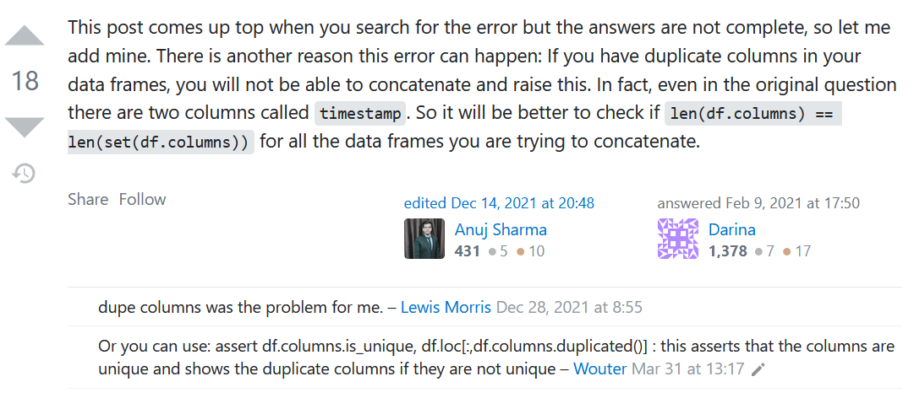

(pandas-python)=
# Functional Pandas in Python workflow 🐼🐍

When beginning Data Science, it is common to directly apply Pandas functions on individual dataframes. But what if you are creating code for a Python dataflow? The approach has to
completely change.

A great rule of thumb is this:

**If you find yourself repeating lines of code, create a <u>loop</u> or <u>lambda function</u>**<br>
**If you find yourself repeating loops and/or lambda functions, create a <u>Python function</u>**<br>
**If you find yourself with many functions, create a <u>Python class</u>**

## Sample functions

The packages being discussed in this part are loaded into Python as follows:
```
import pandas as pd
import numpy as np
```
:::{admonition} Data representation in Python:
:class: note

A good idea for transformation tracking is to represent a collection of Pandas dataframes using a dictionary because it helps you easily locate a particular dictionary to perform operations on. It can be represented like so:
```
dictionary = {
    'df1': df1,
    'df2': df2,
    'df3': df3,
}
```

If you wish to concatenate the dataframes within the dictionary to form one dataframe, run this code:

```
concatenated_df = pd.concat(dictionary.values(), ignore_index=True)
```

:::

:::{admonition} Warning for data representation in Python:
:class: warning

Be careful to ensure that BOTH your columns and rows have unique names

If when using `pd.concat()` you keep getting the error message
`InvalidIndexError: Reindexing only valid with uniquely valued Index objects` even after
modifying the indices of the dataframe, look into your columns.

If your column names fail either of the following logical tests:

```
len(df.columns) == len(set(df.columns))
```

```
assert df.columns.is_unique, df.loc[:,df.columns.duplicated()]
```

then you probably need to rename them.

Diagnostic code if working with a dictionary with many dataframes would be:

```
for key in dictionary:
    df = dictionary[key]
    print(key,'\n','len(df.columns) == len(set(df.columns)) is',
          len(df.columns) == len(set(df.columns)),'\n',
          'df.columns = '+str(len(df.columns)),'\n',
          'set(df.columns = '+str(len(set(df.columns))),'\n',
         )

    duplicates = [duplicate for duplicate in list(df.columns) if list(df.columns).count(duplicate) > 1]
    print(duplicates)
    print('\n')
```

**Source: [Stack Overflow](https://stackoverflow.com/questions/35084071/concat-dataframe-reindexing-only-valid-with-uniquely-valued-index-objects/66124333#66124333)**



:::


### Visualizing your dataset

🔎 The `dataframe_describer` is really useful in viewing the shape and column names of each
dataframe contained in a dictionary within a particular app.

```
def dataframe_describer(df,var_name=''):
    print(f'{var_name} has {df.shape[0]} rows and {df.shape[1]} columns namely:')
    for item in df.columns:
        print(f'{list(df.columns).index(item)+1}.', item)
```

🔎 The `dataframes_displayed` function is really useful in getting summaries of the various columns in each dataframe describing their

* measures of central tendency and data distribution if the datatype is numeric (shown in the code
below as `np.number`)
* the count, the number of unique values, the mode and its frequency if the datatype is an object (a combination of strings shown in the code below as `'O'`) or a categorical variable (shown in the
code below as `'category'`)

and checking for any missing headers or unwanted data in the last values of the dataset.

```
def dataframes_displayed(df_dict={}, input_string=''):

    boolean=bool()

    dataframe_describer(df=df_dict[input_string], var_name=input_string)

    for column in df_dict[input_string].columns:
        display(df_dict[input_string][column].describe(
            include=['O','category', np.number]))

    for column in df_dict[input_string].columns:
        if column.find('Unnamed:') != -1:
            boolean = True

    if boolean == True:
        display(df_dict[input_string].head(5))
        display(df_dict[input_string].tail(5))
    else:
        display(df_dict[input_string].tail(5))
```

:::{admonition} What does `column.find('Unnamed:') != -1` mean?
:class: note

According to [this source](https://tech-related.com/p/6q3ePQloAv):

*The `str.find` method is to find whether there is a character or substring to be found in*<br>
*a given string or a substring within the range of the start and end index. If found, return*<br>
*the index of the appearance position, if not found, return -1.*

So `column.find('Unnamed:') != -1` means that the `'Unnamed'` substring **is not** missing in the
column name.
:::

### Modifying your dataframes

Sometimes you may wish to do a standard operation on a number of dataframes, so it is helpful to
have functions that can do the transformations in one batch, instead of repeating code.

🔎 The `column_remover` is really useful in deleting columns in each dataframe that share the same
column name(s)

```
def column_remover(removed_columns=[],affected_dfs={}):
    modified_dfs = {}
    vals = list(affected_dfs.keys())
    for val in vals:
        modified_df = affected_dfs[val].copy()
        modified_dfs[val] = modified_df.drop(removed_columns,axis=1)
    return modified_dfs
```
:::{admonition} Changing the actual variable
:class: note
To reflect a transformation, make a copy of the dataframe, then modify the dataframe. Store it in a new dictionary and return the transformed dictionary.

It would be best practice to then save the transformation like so:
```
transformed_dataframes = column_remover(
    removed_columns=['a','b'],
    affected_dfs=original_dataframes)
```  
:::

🔎 If we wish to merge changes made to dataframes, ensure the modified dataframes and original dataframes share the same name, then we can run the following code:

```
original_dataframes =  {'df1':df1,
                        'df2':df2,
                        'df3':df3}

transformed_dataframes =   {'df1':df1,
                            'df3':df3}

current_dataframes = {**original_dataframes, **transformed_dataframes}
```

:::{admonition} Warning:
:class: warning
Be VERY CAREFUL with the order; the transformed dictionary is put second, so
that the update is reflected; if this is not done, the changes will be overwritten.
:::


🔎 The `blank_row_remover` is really useful in deleting blank rows in each dataframe; `thresh=4` means that blank rows
and rows that have 3 filled values or less will be deleted. 

```
def blank_row_remover(affected_dfs={}, silent=bool()):
    modified_dfs = {}
    
    if silent == False:
        print('Before:')
        for key in affected_dfs:
            blank_rows = affected_dfs[key][
                affected_dfs[key].isna().all(axis=1) == True].shape[0]
            any_nulls = affected_dfs[key][
                affected_dfs[key].isna().any(axis=1) == True].shape[0]        
            print(f'There were {blank_rows} blank rows and {any_nulls} rows',
                  f'containing null values in {key}.')

    for val in affected_dfs:
        modified_df = affected_dfs[val].copy()
        modified_dfs[val] = modified_df.dropna(axis=0,how='all',thresh=4)

    if silent == False:
        print('\n')
        print('After:')
        for key in modified_dfs:
            blank_rows = modified_dfs[key][
                modified_dfs[key].isna().all(axis=1) == True].shape[0]
            any_nulls = modified_dfs[key][
                modified_dfs[key].isna().any(axis=1) == True].shape[0]
            print(f'There were {blank_rows} blank rows and {any_nulls} rows',
                  f'containing null values in {key}.')
        
    return modified_dfs
```

🔎 The `header_promoter` is really useful in identifying dataframes within a dictionary that are
missing headers, and then promoting the header in that case.

```
def header_promoter(affected_dfs={}, silent=bool()):
    
    boolean=bool()
    modified_dfs = {}
    
    for val in affected_dfs:
        for column in affected_dfs[val].columns:
            if column.find('Unnamed:') != -1:
                boolean = True
                
        if boolean == True:
            modified_df = affected_dfs[val].copy()
            modified_df.columns = modified_df.iloc[0,:]
            # drop the column name source
            modified_df = modified_df.drop(index=modified_df.index[0], axis=0)
            modified_dfs[val] = modified_df
    
    if silent == False:
        for key in affected_dfs:
            df_name = key.upper()
            df_name = df_name.replace('_',' ')
        
            print(f'{df_name} before:')
            display(affected_dfs[key].head(3))
            print('\n')
        
            print(f'{df_name} after:')
            display(modified_dfs[key].head(3))
            print('\n')
    
    return modified_dfs
```

Notice that in the 3 example functions, we incorporate
* output that allows us to see the before and after transformation
* use of `silent=bool()` argument to show or hide the output as needed

:::{admonition} N/B:
:class: note

You can also name variables using the dictionary keys (which are strings)

If we want the variable to be a global one:

```
new_number = dict_key + '_new_number'
globals()[new_number] = 25
```

and if we want it to exist only locally:

```
new_number = dict_key + '_new_number'
locals()[new_number] = 25
```
Local variables are stored in the `locals()` dictionary and global variables are stored in the `globals()` dictionary.

:::

## Leveraging `numpy` with `pandas` in Python

`np.repeat(a=np.array()|pd.Series()|pd.DataFrame(),n,axis=0|1)` allows you to repeat each item in `a` $n$ number of times, creating either `n` number of columns if `axis=1` or `n` number of rows if `axis=0`, while `np.tile(a=np.array()|pd.Series()|pd.DataFrame(),n)` allows you to duplicate `a` $n$ number of times.
