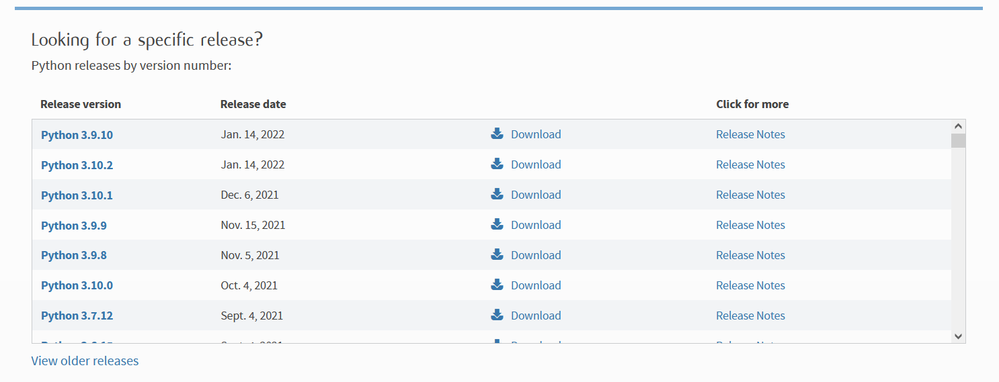
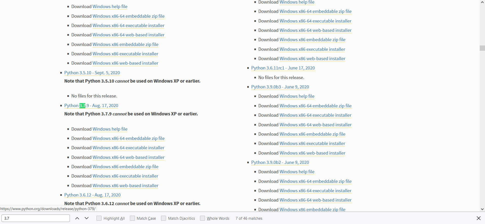
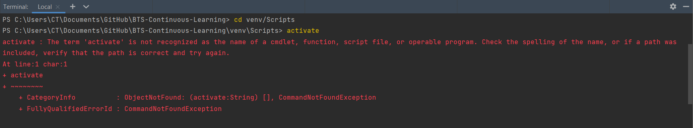
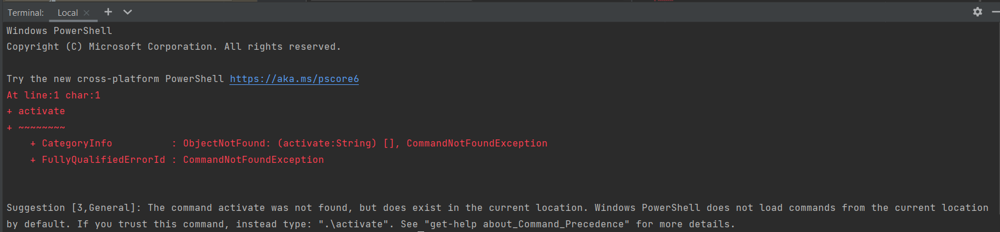
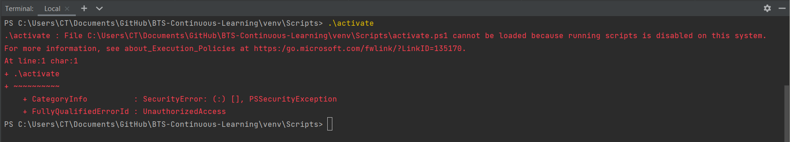
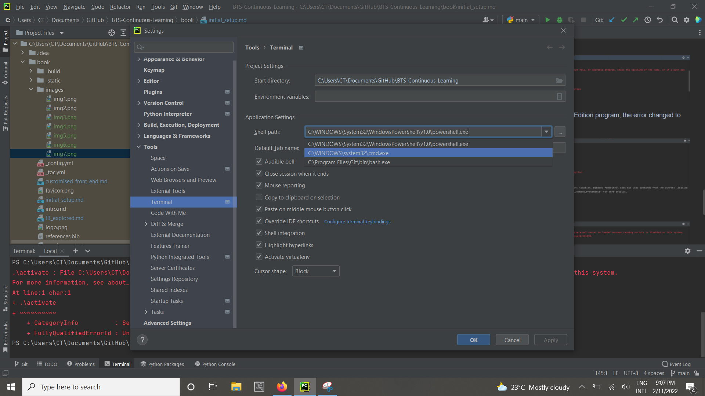
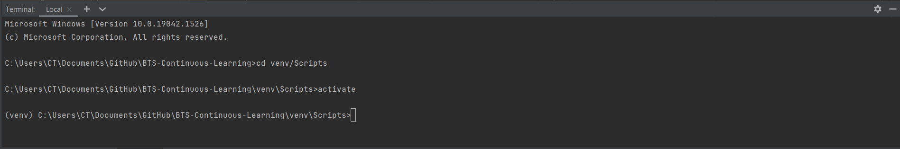

(initial-setup)=
# Initial Setup \& Maintenance 🛠️

The tech stack that I had to create and deploy this
book was:
* A Windows environment
* PyCharm Community Edition
* GitHub Desktop

Some mistakes I made in setup include:
* Installing and running Jupyter Book on Python 3.9
* Trying to install a g-zipped version of Python 3.7 to install the latest version (Python 3.7.12)
* Navigating to the gh-pages branch

Some challenges I faced in setup include:
* Deploying the sample book
* Activating a virtual environment in PyCharm after navigating between Git branches

__Let's go through these mistakes in more detail!__

## Installing and running Jupyter Book on Python 3.9

The latest version of Python today is Python 3.10, but
I routinely use Python 3.9 on my local machine.

I managed to install `jupyter-book` and successfully
ran the command:

```
jupyter-book create mynewbook/
```

So imagine the surprise I experienced, following
<a href='https://jupyterbook.org/start/create.html'>this
tutorial</a> when I ran

```
jupyter-book build book/
```

and got <a href='https://github.com/executablebooks/jupyter-book/issues/906'>
this problem</a>.

I wish I started by reading the warning
<a href='https://jupyterbook.org/start/your-first-book.html'>
here</a> and then navigating to 
<a href='https://jupyterbook.org/advanced/windows.html#working-on-windows'>
Working on Windows</a>

:::{admonition} Lesson 1:
:class: note
Learn how to set up Jupyter Book based on your OS
environment.
:::

## Trying to install the latest version of Python 3.7

When I found that Python 3.7 was required, my natural
inclination was to go
<a href='https://www.python.org/downloads/'>here</a>
and zoom in to Python 3.7.12:



It came as a `.tgz` which I unzipped on Administrator
Windows `cmd` with the following code:

```
tar -xvzf C:\Users\CT\Downloads\Python-3.7.12.tgz -C C:\Users\CT\Downloads  
```

When I unzipped it, I felt stuck because I couldn't
activate it without a crazy amount of searching.

There had to be a better way.

So I decided to search for versions of Python 3.7
that had a `.exe` file for Windows
<a href='https://www.python.org/downloads/windows/'>
here</a>
settling on Python 3.7.9:



I clicked the *Download Windows x86-64 executable
installer* because my machine is 64-bit. I installed
it with default installation instructions, and I was
able to create a virtual environment `venv` in my project
that ran on Python 3.7 as follows:

I changed to the main directory, `BTS-Continuous-Learning`
then ran

```
virtualenv -p python3.7 venv
```

All that's left is activating `venv` and checking that
the correct version of Python is running with the code
below:

```
py --version
```

Finally, in Github Desktop after committing the files
created with

```
jupyter-book create mynewbook/
```

I added all `venv` files to `.gitignore`.

:::{admonition} Lesson 2:
:class: note
Use a `.exe` installer to install Python on your
machine; avoid zipped files.
:::

## Activating a virtual environment in PyCharm

The first time (when the only Git branch that I had
was `main`, it was easy enough to activate the virtual
environment in PyCharm. However, when I navidated to the
`gh-pages` branch in GitHub Desktop, I started getting a
weird error in the terminal like



When I upgraded my PyCharm community Edition program,
the error changed to this:



Following the suggestion, this happened:



So what was the solution?

I navigated first to the `File` menu, then clicked on
`Settings` resulting in the following screen:


I then navigated to `Tools`, then `Terminal`, and changed the
Shell path from `Powershell`'s path to `cmd`'s path like so:



Problem solved!



Work within the environment and clear the workspace with `cls`
command.

:::{admonition} Lesson 3:
:class: note
Use a `cmd` engine within Pycharm instead of `Powershell` to
activate the virtual environment.
:::

## Deployment of the site

Updating the book was easy enough with the `jb build --all book/`
command once the virtual environment was activated.

I then
* Pushed any changes in `book`, `_static` and `images` folders on the `main` branch to remote
* Installed `ghp-import` with the `pip install ghp-import` command
* Changed into the directory containing the files with `cd book/` command
* Created a `gh-pages` branch (when the command ran the first time) or pushed the changes to the `gh-pages` branch with the `ghp-import -n -p -f _build/html` command

:::{admonition} Warning:
:class: warning
When running the `ghp-import -n -p -f _build/html` command,
DO NOT forget to add `-n`; the reason why is well explained
<a href='https://jupyterbook.org/publish/gh-pages.html'>here
</a>.
:::

Initially, after deploying the page, I would navigate to the
`gh-pages` branch, but I realised that it was not necessary since
running the `ghp-import -n -p -f _build/html` command
automatically sends local changes to remote in the `gh-pages`
branch.

<br>
