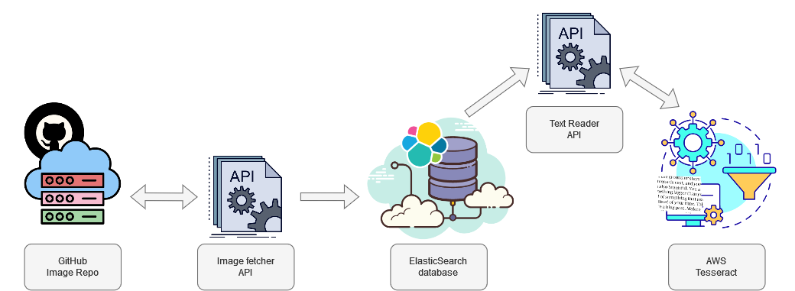
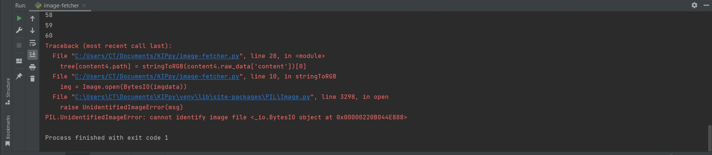

(api-setup)=

# API Building Notes

When building an API, I found it very helpful for me to:
1. Sketch out the key tasks that I wanted the API(s) to do for me
2. Split these key tasks into project phases
3. At each phase,
   * Code a sample script to get a feel for the process, troubleshooting any errors along the way
   * Use the sample script to update a database of choice locally
   * Identify the resources and sub-resources generated by the processes
   * Identify the modules, functions and classes resulting from each key process
   * Arrange the code under a REST API framework of choice
   * Deploy the code in a VPS after [server setup](./server_setup.md)

## Fleshing out the processes and tasks

The first step having a high-level understanding of the process, which I visualized below:



### Fleshing out `Image Fetcher` API

I then wrote a sample Python script, leveraging
* The [PyGithub library](https://pygithub.readthedocs.io/en/stable/introduction.html) and
* A token that I had created in Github with limited scope (I could only access the image repository)

The code is below:
```
from PIL import Image
from io import BytesIO
import base64
from github import Github
import cv2
import numpy as np

def stringToRGB(base64_string):
    imgdata = base64.b64decode(str(base64_string))
    img = Image.open(BytesIO(imgdata))
    opencv_img = cv2.cvtColor(np.array(img), cv2.COLOR_BGR2RGB)
    return [img,opencv_img]

username = 'username' # your Github username
password = 'token'

# authenticate to github
g = Github(username, password)
# get the authenticated user
user = g.get_user()
for repo in user.get_repos():
    if repo.full_name == "username/Kenyans_in_Media_NLP_CV_data":
        tree = {}
        for content1 in repo.get_contents(""):
            for content2 in repo.get_contents("/Dec_2021"):
                for content3 in repo.get_contents("/" + content2.path):
                    for content4 in repo.get_contents("/" + content3.path + "/cropped"):
                        tree[content4.path] = stringToRGB(content4.raw_data['content'])[0]
                        print(len(tree.keys()))
                        if len(tree.keys()) == 60:
                            tree[content4.path].show()

```

Having ran the sample script, I noticed a couple of things:
1. I had a really hard time decoding the images because they were represented as `base64` objects in their raw state; luckily, [this solution](https://stackoverflow.com/questions/16214190/how-to-convert-base64-string-to-image) helped me get unstuck
2. When I ran the script, It ran 60 times before it the error below:<br>
<br>
When I dug deeper into the local version of the repo, I realized that the code could only keep going down the tree until it had no more images to dig up, making it throw the error above; data collected was from only 1 newspaper.

The code above gave me the following ideas around the tasks that I would like `Image Fetcher` to do and the accompanying tests for each task:

| Tasks                                                       | Tests                                                                                                                                                                                                                                                                |
|-------------------------------------------------------------|----------------------------------------------------------------------------------------------------------------------------------------------------------------------------------------------------------------------------------------------------------------------|
| Access GitHub via username and token                        | i) Are credentials hidden in the system?<br> ii) Is the username valid?<br> iii) If the username is valid, is the token valid?                                                                                                                                       |
| Obtain all possible paths to the cropped images from archive | i) Can the `path collector` be able to move up and down the directory tree?<br> ii) Is each collected path matching filesystem on server?<br> iii) Is there any content at each collected path?<br> iv) Is the content at each collected path the expected datatype? |
| Obtain the image and decrypt it                             | i) Is the `base64` encoded string decoded as a valid image file i.e. visualizable?                                                                                                                                                                                   |
| Store the image in ElasticSearch database                   | i) Is the code output JSONified?                                                                                                                                                                                                                                     |

My framework of choice for building an app was Flask ([this article](https://realpython.com/api-integration-in-python/) 
and [this one](https://realpython.com/flask-connexion-rest-api/) were really great in easing me into the world of APIs).
This resulted in the following code within the Flask framework (which gave me all the cropped scanned images in the 
repository):
```
from flask import Flask
from dotenv import load_dotenv
import os
from github import Github

app = Flask(__name__)

load_dotenv(r"C:\Users\CT\Documents\GitHub\KIP\kenyans-in-print\.env")

# get username and password
username = os.getenv("g_user")
password = os.getenv("g_pwd")
# authenticate to github
g = Github(username, password)
# get the authenticated user
user = g.get_user()

@app.route("/images", methods=["GET"])
def image_fetcher():
    # get image paths
    paths = []
    for repo in user.get_repos():
        if repo.full_name == "CeeThinwa/Kenyans_in_Media_NLP_CV_data":
            for content1 in repo.get_contents(""):
                months = ['Dec_2021']  # 'Jan_2022', 'Feb_2022'] will uncomment as I crop the images and build the MVP
                for month in months:
                    for content2 in repo.get_contents(f"/{month}"):
                        for content3 in repo.get_contents("/" + content2.path):
                            for content4 in repo.get_contents("/" + content3.path + "/cropped"):
                                paths.append(content4.path)

    # get images as raw byte strings
    image_tree = {}
    for i in range(100):
        for repo in user.get_repos():
            if repo.full_name == "CeeThinwa/Kenyans_in_Media_NLP_CV_data":
                image_tree[i] = {
                    "path": paths[i],
                    "raw_image": repo.get_contents("/" + paths[i]).raw_data["content"]
                }

    return image_tree
```
One of the learnings that I got was that binary objects, OpenCV or Pillow objects can't be serialized in JSON, so the
images have to maintained as byte strings.

Due to the multiple challenges creating an ElasticSearch database locally (which I cover in more detail [here](./database_setup.md)),
I decided to focus on testing the code locally by connecting to GitHub to get the data, but not saving any results locally.

### Fleshing out `Text Reader` API

This stage was trickier because AWS has a certain way it's resources can be used, making it more
complex than GitHub. The pre-work I had to do from an AWS perspective was:
1. Create a user account in AWS and map it to the root account
2. Create a scope to allow the new user full access to Textract
3. Create a key as the login method for the child user to use Textract

Once this was in play, I ran the following sample script that easily analyzed a local test image with great results:
```
import boto3

client = boto3.client('textract', region_name='us-east-1')


# Read image
with open('part.jpg', 'rb') as document
    img = bytearray(document.read())

# Call Amazon Textract
response = client.detect_document_text(
    Document={'Bytes': img}
)

# Print detected text
result_string = ''
for item in response["Blocks"]:
    if item["BlockType"] == "LINE":
        print ('033[94m' +  item["Text"] + '033[0m')
# https://stackoverflow.com/questions64045020using-textract-for-ocr-locally
        result_string += ' ' + '033[94m' +  item[Text] + '033[0m'

print('n',result_string)
```

To avoid the hassle of encrypting then decrypting the binary images, I decided to make this API
1. Fetch directly from GitHub the image
2. When all GitHub images are in memory, I then call the Textract service and get the result.

The code in the Flask framework thus became:
```
from flask import Flask
from dotenv import load_dotenv
import os
from github import Github
import boto3

app = Flask(__name__)

load_dotenv(r"C:\Users\CT\Documents\GitHub\KIP\kenyans-in-print\.env")

# get username and password
username = os.getenv("g_user")
password = os.getenv("g_pwd")
# authenticate to github
g = Github(username, password)
# get the authenticated user
user = g.get_user()

# connect to Amazon Textract
client = boto3.client('textract', region_name='us-east-1')


@app.route("/texts", methods=["GET"])
def image_to_text():
    # get image paths
    paths = []
    for repo in user.get_repos():
        if repo.full_name == "CeeThinwa/Kenyans_in_Media_NLP_CV_data":
            for content1 in repo.get_contents(""):
                months = ['Dec_2021']  # 'Jan_2022', 'Feb_2022'] will uncomment as I crop the images and build the MVP
                for month in months:
                    for content2 in repo.get_contents(f"/{month}"):
                        for content3 in repo.get_contents("/" + content2.path):
                            for content4 in repo.get_contents("/" + content3.path + "/cropped"):
                                paths.append(content4.path)

    # get images as bytes
    text_tree = {}
    for i in range(0,60):
        for repo in user.get_repos():
            if repo.full_name == "CeeThinwa/Kenyans_in_Media_NLP_CV_data":
                # to get bytes from github as per https://github.com/PyGithub/PyGithub/issues/576, repo.get_contents(
                # "/" + paths[ i]).decoded_content
                img = repo.get_contents("/" + paths[i]).decoded_content

                # Call Amazon Textract
                response = client.detect_document_text(
                    Document={'Bytes': img})

                # get detected text as per https://stackoverflow.com/questions64045020using-textract-for-ocr-locally
                result_string = ''
                for item in response["Blocks"]:
                    if item["BlockType"] == "LINE":
                        result_string += item["Text"] + '\n'

                #get raw text
                text_tree[i] = {
                    "path": paths[i],
                    "raw_text": result_string
                }

    return text_tree
```

However, when running the app, it ran into the same problem encountered initially - it could only analyse 60 images,
which were taken from articles published on the earliest newspaper as per data in the repository.
