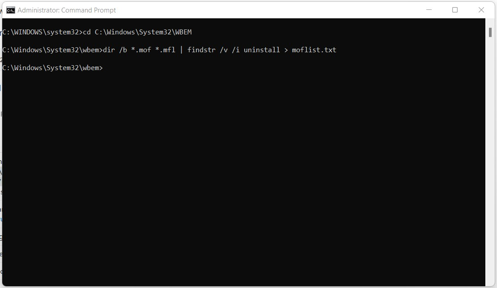
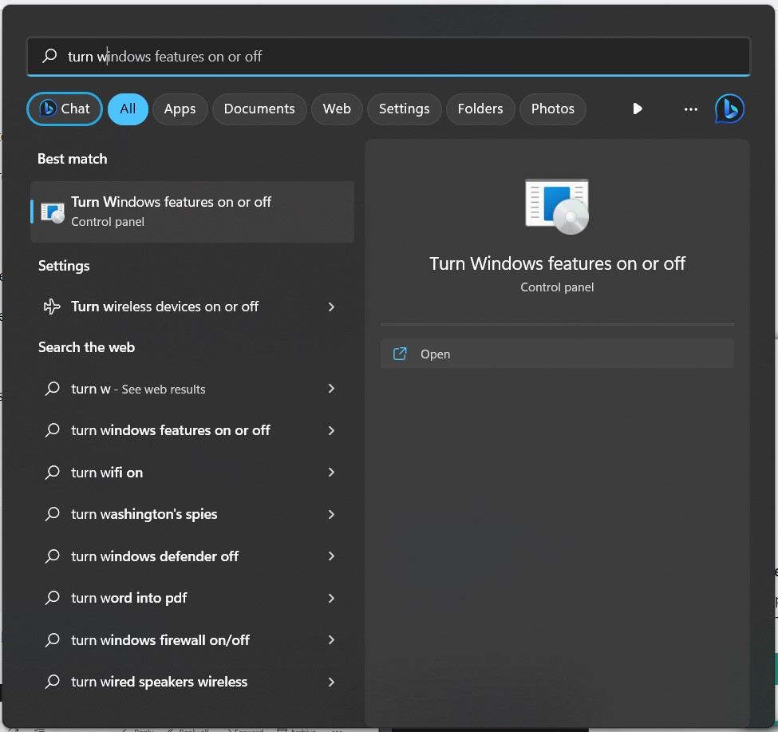
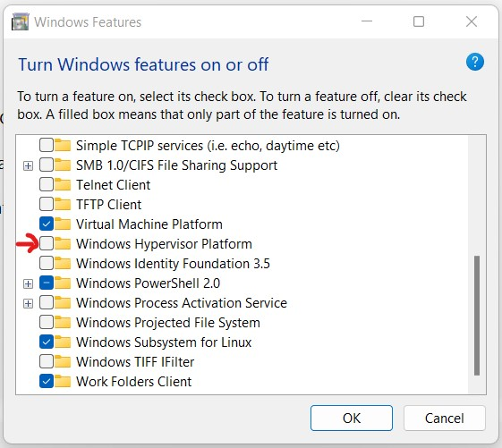
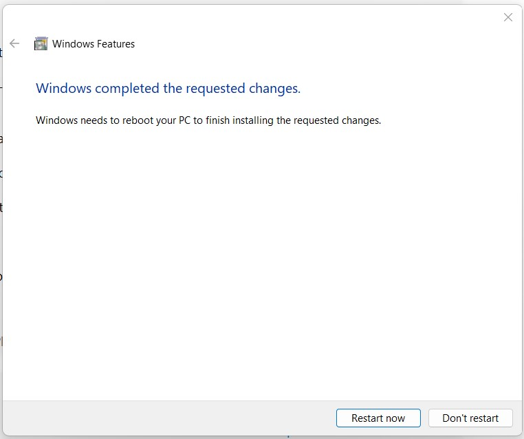
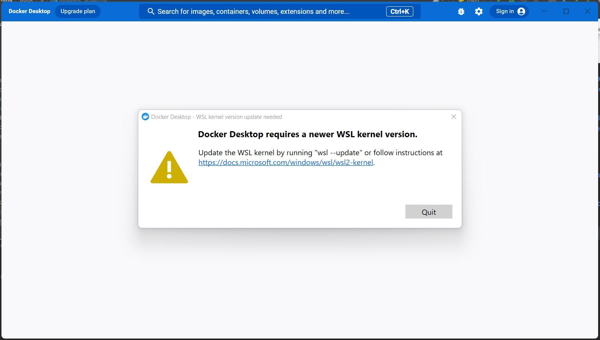
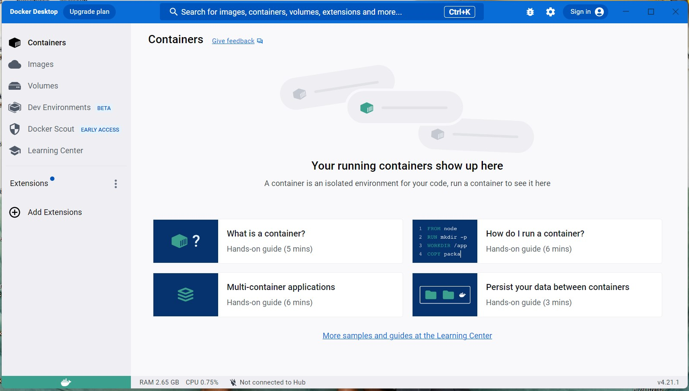
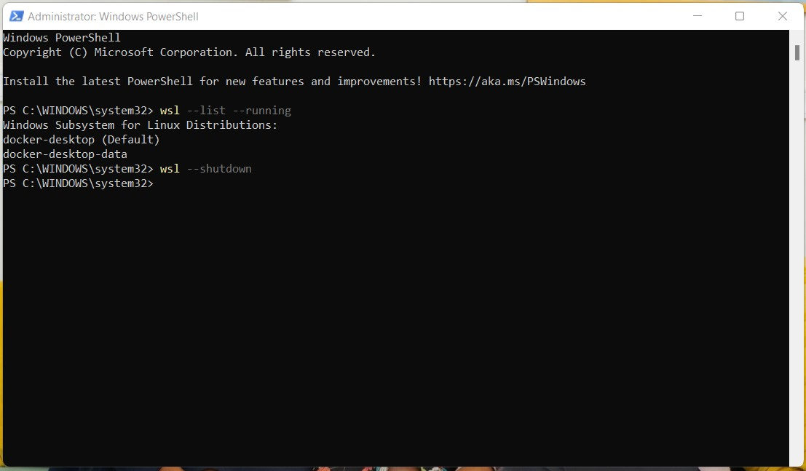
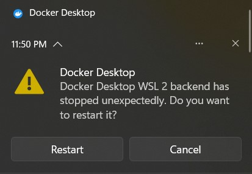

(db-setup)=
# Database Setup Notes

## NoSQL Database

The database of choice that I decided to adopt in this category was *ElasticSearch*.

Based on [the page where one could get started](https://www.elastic.co/webinars/getting-started-elasticsearch),
I went to their [download page](https://www.elastic.co/downloads/elasticsearch).

### Local *ElasticSearch* setup

I decided to first set it up locally on my Windows.

#### <u>Docker setup on Windows: my experience</u>

Elasticsearch runs within a Docker container, so I went [here](https://www.docker.com/products/docker-desktop/)
to download Docker Desktop.

If you directly attempt to install Docker Desktop, you get the following error:


As per the guidance in [this article](https://stackoverflow.com/questions/71095210/installing-docker-desktop-4-5-0-failed-componet-communityinstaller-enablefeatur)
I managed the Windows Management Instrumentation (WMI) by entering my Command Prompt and running the commands below:




I then rebooted and voila!


However when I started Docker, I got the following notice:


So as per the advice in these 2 articles ([here](https://stackoverflow.com/questions/39684974/docker-for-windows-error-hardware-assisted-virtualization-and-data-execution-p) and
[here](https://stackoverflow.com/questions/56141254/enabling-hyper-v-in-bios-is-required-for-docker-to-work)),
I ran the following commands in Windows Powershell as an admin:


However, due to the error shown, I had to navigate to control panel "Turn Windows Features on or off"
and select the checkbox for the feature pointed at (as you can see, it was off):





Once I checked it and the update finished installation, I got the following prompt to restart my
machine:



To turn on Virtualization in the BIOS menu, as per [this article](https://www.thewindowsclub.com/disable-hardware-virtualization-in-windows-10),
when restarting the computer, press `shift` and `F10` until you access the Windows blue screen where you:
1. click the `Troubleshoot` tile, then
2. select `Advanced Options`,
3. and select `UEFI Firmware Settings`;
4. click the `Restart` option afterward and
5. once the black screen appears click `F10` to enter the BIOS menu.

Once in the BIOS menu, navigate to the `Virtualization` option and select `Enable`.

When opening Docker again, I got a new error:



When I went to [this link](https://learn.microsoft.com/en-us/windows/wsl/install-manual#step-4---download-the-linux-kernel-update-package), I ran the
`wsl.exe --update` command in Powershell as an admin like so:


Voila! The docker engine can now run.



To configure memory to 4 GB as per the ElasticSearch README file in the installation package,
I followed [this resource](https://learn.microsoft.com/en-us/windows/wsl/wsl-config#configure-global-options-with-wslconfig),
[this resource](https://superuser.com/questions/1765370/cannot-locate-wslconfig-in-user-profile-on-windows-11) and
[this resource](https://github.com/MicrosoftDocs/wsl/blob/main/WSL/wsl-config.md)
to create a `.wslconfig` file.

I then ran the following commands:



This caused the following prompt to appear:



Once I clicked `Restart`, the WSL debugger and Docker opened and ran the updates from the `.wslconfig` file like so: 


:::{admonition} Warning:
:class: warning
Update: When I attempted to open docker in a new session after restarting and effecting the
configuration settings, I was unable to start Docker (both normally and as an admin). I was
forced to do a Factory Reset to get Docker up and running once more.
:::


#### <u>ElasticSearch Setup</u>

In the virtual environment of my project, as per the ElasticSearch README file in the installation package I ran
the following commands:

```
docker network create elastic
docker pull docker.elastic.co/elasticsearch/elasticsearch:8.8.2
```

This enabled me to install ElasticSearch successfully, as per the status below:


:::{admonition} Warning:
:class: warning
As per [these instructions](https://www.elastic.co/guide/en/elastic-stack/current/installing-elastic-stack.html),
it's VERY important to install components in the following order:
1. ElasticSearch: `docker run --name elasticsearch --net elastic -p 9200:9200 -p 9300:9300 -e "discovery.type=single-node" -t docker.elastic.co/elasticsearch/elasticsearch:8.8.2`
2. Kibana: `docker run --name kibana --net elastic -p 5601:5601 docker.elastic.co/kibana/kibana:8.8.2`
3. Logstash
4. Beats
5. APM
6. Elasticsearch Hadoop
:::

For my purposes, I only installed ElasticSearch and Kibana.

I then went to Docker desktop and clicked the port connected to Kibana in the format `http://localhost:{xxxx}/?code={yyyyyy}`
where `{xxxx}` represents the port number and `{yyyyyy}` represents the code given after the second command was ran.

````
✅ Elasticsearch security features have been automatically configured!
✅ Authentication is enabled and cluster connections are encrypted.

ℹ️  Password for the elastic user (reset with `bin/elasticsearch-reset-password -u elastic`):
  T1LxKXhlAQVFZGmHylBa

ℹ️  HTTP CA certificate SHA-256 fingerprint:
  18c2aed49edcf64fe312f1f7eea2c8051d1e4ef1419d406d1b6c74b55a54bb71

ℹ️  Configure Kibana to use this cluster:
• Run Kibana and click the configuration link in the terminal when Kibana starts.
• Copy the following enrollment token and paste it into Kibana in your browser (valid for the next 30 minutes):
  eyJ2ZXIiOiI4LjguMiIsImFkciI6WyIxNzIuMTguMC4yOjkyMDAiXSwiZmdyIjoiMThjMmFlZDQ5ZWRjZjY0ZmUzMTJmMWY3ZWVhMmM4MDUxZDFlNGVmMTQxOWQ0MDZkMWI2Yzc0YjU1YTU0YmI3MSIsImtleSI6Imt0RngzSWtCeDRXcHo0SnVuUmhHOkliTFltMW44U3FDOXp3NXJ5U3NDY2cifQ==

ℹ️ Configure other nodes to join this cluster:
• Copy the following enrollment token and start new Elasticsearch nodes with `bin/elasticsearch --enrollment-token <token>` (valid for the next 30 minutes):
  eyJ2ZXIiOiI4LjguMiIsImFkciI6WyIxNzIuMTguMC4yOjkyMDAiXSwiZmdyIjoiMThjMmFlZDQ5ZWRjZjY0ZmUzMTJmMWY3ZWVhMmM4MDUxZDFlNGVmMTQxOWQ0MDZkMWI2Yzc0YjU1YTU0YmI3MSIsImtleSI6Ims5RngzSWtCeDRXcHo0SnVuUmhIOmpJejFjV0tBVExtUU1DaTNqMWJmMlEifQ==

  If you're running in Docker, copy the enrollment token and run:
  `docker run -e "ENROLLMENT_TOKEN=<token>" docker.elastic.co/elasticsearch/elasticsearch:8.8.2`
````

http://localhost:5601/?code=496837