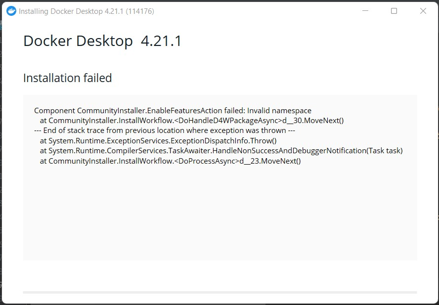
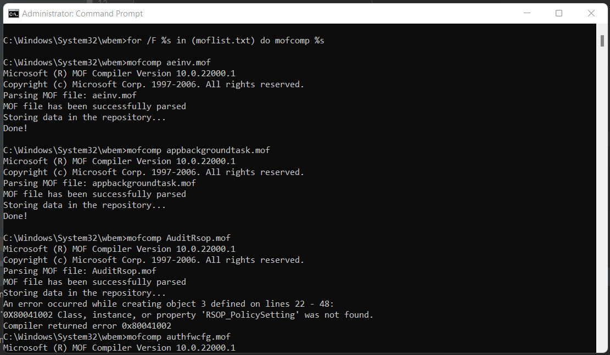
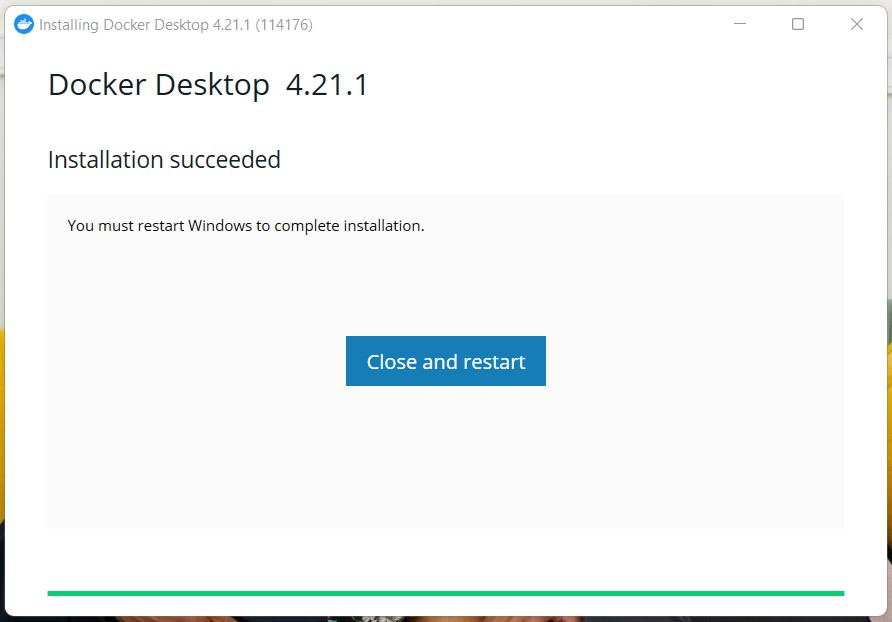
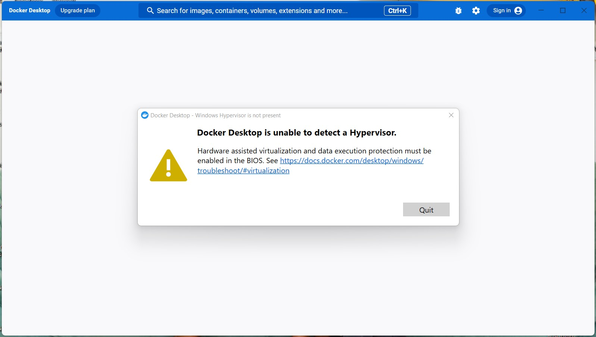
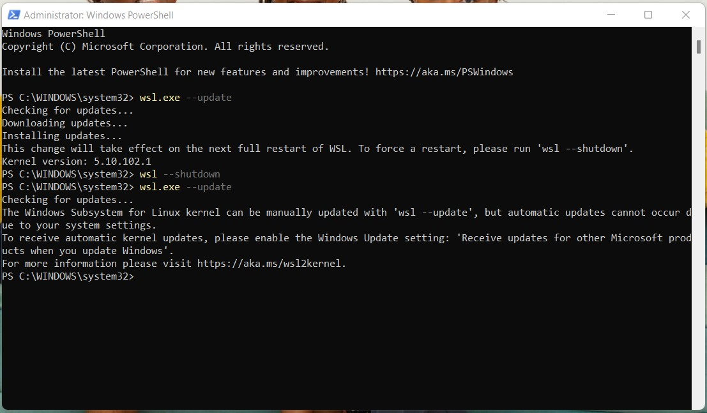

(db-setup)=
# Database Setup Notes

## NoSQL Database

The database of choice that I decided to adopt in this category was *ElasticSearch*.

Based on [the page where one could get started](https://www.elastic.co/webinars/getting-started-elasticsearch),
I went to their [download page](https://www.elastic.co/downloads/elasticsearch).

### Local *ElasticSearch* setup

I decided to first set it up locally on my Windows.

#### <u>Docker setup on Windows: my experience</u>

Elasticsearch runs within a Docker container, so I went [here](https://www.docker.com/products/docker-desktop/)
to download Docker Desktop.

If you directly attempt to install Docker Desktop, you get the following error:

As per the guidance in [this article](https://stackoverflow.com/questions/71095210/installing-docker-desktop-4-5-0-failed-componet-communityinstaller-enablefeatur)
I managed the Windows Management Instrumentation (WMI) by entering my Command Prompt and running the commands below:

I then rebooted and voila!

However when I started Docker, I got the following notice:

So as per the advice in these 2 articles ([here](https://stackoverflow.com/questions/39684974/docker-for-windows-error-hardware-assisted-virtualization-and-data-execution-p) and
[here](https://stackoverflow.com/questions/56141254/enabling-hyper-v-in-bios-is-required-for-docker-to-work)),
I ran the following commands in Windows Powershell as an admin:

However, due to the error shown, I had to navigate to control panel "Turn Windows Features on or off"
and select the checkbox for the feature pointed at (as you can see, it was off):

Once I checked it and the update finished installation, I got the following prompt to restart my
machine:

To turn on Virtualization in the BIOS menu, as per [this article](https://www.thewindowsclub.com/disable-hardware-virtualization-in-windows-10),
when restarting the computer, press `shift` and `F10` until you access the Windows blue screen where you:
1. click the `Troubleshoot` tile, then
2. select `Advanced Options`,
3. and select `UEFI Firmware Settings`;
4. click the `Restart` option afterward and
5. once the black screen appears click `F10` to enter the BIOS menu.

Once in the BIOS menu, navigate to the `Virtualization` option and select `Enable`.

When opening Docker again, I got a new error:

When I went to [this link](https://learn.microsoft.com/en-us/windows/wsl/install-manual#step-4---download-the-linux-kernel-update-package), I ran the
`wsl.exe --update` command in Powershell as an admin like so:

Voila! The docker engine can now run.

To configure memory to 4 GB as per the ElasticSearch README file in the installation package,
I followed [this resource](https://learn.microsoft.com/en-us/windows/wsl/wsl-config#configure-global-options-with-wslconfig)
to create a `.wslconfig` file.

#### <u>ElasticSearch Setup</u>

ElasticSearch 8.8.2
