(db-setup)=
# Database Setup Notes

## NoSQL Database

The database of choice that I decided to adopt in this category was *ElasticSearch*.

:::{admonition} Options for reading this article
:class: note
A lot of trial and error took place to get to my installation solution over a period of almost 3 months.

If you wish to fast-forward to how I installed ElasticSearch successfully, read [**Attempt 3**](https://ceethinwa.github.io/BTS-Continuous-Learning/6/database_setup.html#u-attempt-3-u).

If you wish to learn more about my journey, keep reading the next section.
:::


### Local *ElasticSearch* setup

Based on [the page where one could get started](https://www.elastic.co/webinars/getting-started-elasticsearch),
I went to their [download page](https://www.elastic.co/downloads/elasticsearch).

I decided to first set it up locally on my Windows.

#### <u>Docker setup on Windows: my experience</u>

Elasticsearch runs within a Docker container, so I went [here](https://www.docker.com/products/docker-desktop/)
to download Docker Desktop.

If you directly attempt to install Docker Desktop, you get the following error:


As per the guidance in [this article](https://stackoverflow.com/questions/71095210/installing-docker-desktop-4-5-0-failed-componet-communityinstaller-enablefeatur)
I managed the Windows Management Instrumentation (WMI) by entering my Command Prompt and running the commands below:


I then rebooted and voila!


However when I started Docker, I got the following notice:


So as per the advice in these 2 articles ([here](https://stackoverflow.com/questions/39684974/docker-for-windows-error-hardware-assisted-virtualization-and-data-execution-p) and
[here](https://stackoverflow.com/questions/56141254/enabling-hyper-v-in-bios-is-required-for-docker-to-work)),
I ran the following commands in Windows Powershell as an admin:


However, due to the error shown, I had to navigate to control panel "Turn Windows Features on or off"
and select the checkbox for the feature pointed at (as you can see, it was off):


Once I checked it and the update finished installation, I got the following prompt to restart my
machine:


To turn on Virtualization in the BIOS menu, as per [this article](https://www.thewindowsclub.com/disable-hardware-virtualization-in-windows-10),
when restarting the computer, press `esc` and `F10` until you access the black screen appears click `F10` to enter the BIOS menu.

Once in the BIOS menu, navigate to the `Virtualization` option and select `Enable`.

When opening Docker again, I got a new error:


When I went to [this link](https://learn.microsoft.com/en-us/windows/wsl/install-manual#step-4---download-the-linux-kernel-update-package), I ran the
`wsl.exe --update` command in Powershell as an admin like so:


Voila! The docker engine can now run.


To configure memory to 4 GB as per the ElasticSearch README file in the installation package,
I followed [this resource](https://learn.microsoft.com/en-us/windows/wsl/wsl-config#configure-global-options-with-wslconfig),
[this resource](https://superuser.com/questions/1765370/cannot-locate-wslconfig-in-user-profile-on-windows-11) and
[this resource](https://github.com/MicrosoftDocs/wsl/blob/main/WSL/wsl-config.md)
to create a `.wslconfig` file.

I then ran the following commands:


This caused the following prompt to appear:


Once I clicked `Restart`, the WSL debugger and Docker opened and ran the updates from the `.wslconfig` file like so: 


:::{admonition} Warning:
:class: warning
Update: When I attempted to open docker in a new session after restarting and effecting the
configuration settings, I was unable to start Docker (both normally and as an admin). I was
forced to do a Factory Reset to get Docker up and running once more.
:::


#### <u>ElasticSearch Setup</u>

In the virtual environment of my project, as per the ElasticSearch README file in the installation package I ran
the following commands:

```
docker network create elastic
docker pull docker.elastic.co/elasticsearch/elasticsearch:8.8.2
```

This enabled me to install ElasticSearch successfully, as per the status below:


For my purposes, I only installed ElasticSearch and Kibana.

:::{admonition} Warning:
:class: warning
As per [these instructions](https://www.elastic.co/guide/en/elastic-stack/current/installing-elastic-stack.html),
I installed components in the following order:
* ElasticSearch:
```
docker pull docker.elastic.co/elasticsearch/elasticsearch:8.8.2
docker network create elastic
docker run --name elasticsearch --net elastic -p 9200:9200 -p 9300:9300 -e "discovery.type=single-node" -t docker.elastic.co/elasticsearch/elasticsearch:8.8.2
```
* Kibana:
```
docker pull docker.elastic.co/kibana/kibana:8.8.2
docker run --name kibana --net elastic -p 5601:5601 docker.elastic.co/kibana/kibana:8.8.2
```

----

**16.08.2023 Update:**

However, it was very difficult to replicate results, and `wsl` (Linux in a Windows environment) is not a debugging platform.
This meant that for almost 2 weeks, my Windows machine was hanging, and security components for ElasticSearch did not automatically
install, making it impossible for the enrollment code needed by Kibana to be generated.

For this reason, I decided to install ElasticSearch and use it in a [Virtual Private Server](VM-setup).


### Virtual *ElasticSearch* setup

#### <u>Attempt 1</u>

My first attempt was guided by [this article](https://www.elastic.co/guide/en/elasticsearch/reference/current/targz.html).

The first error I came across was (even after successfully running ElasticSearch and Kibana on the server)<br>
having empty responses from the server and not being able to connect to the server internally
as shown by the screenshots below:


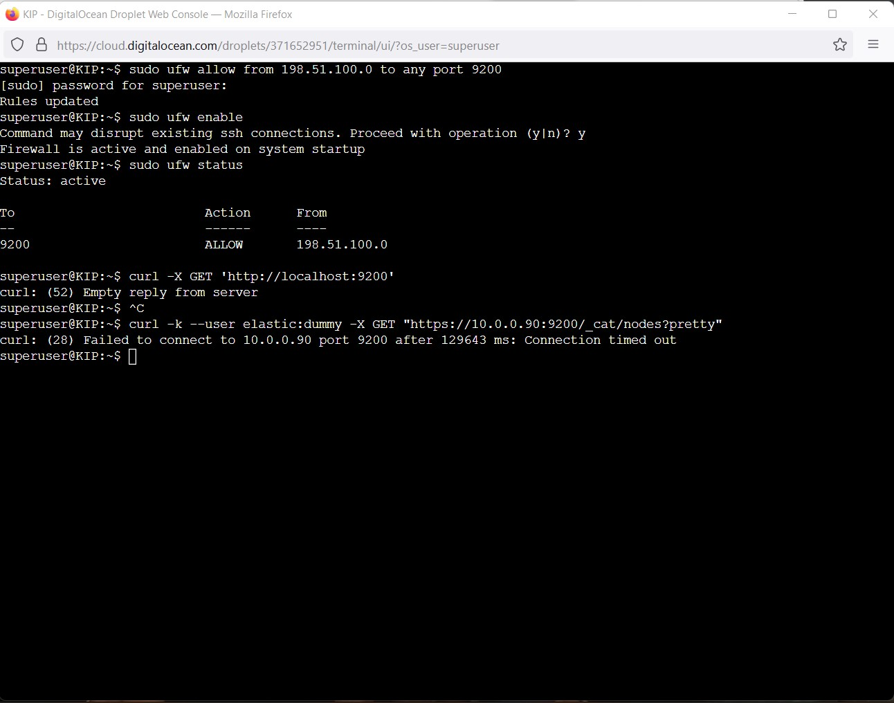


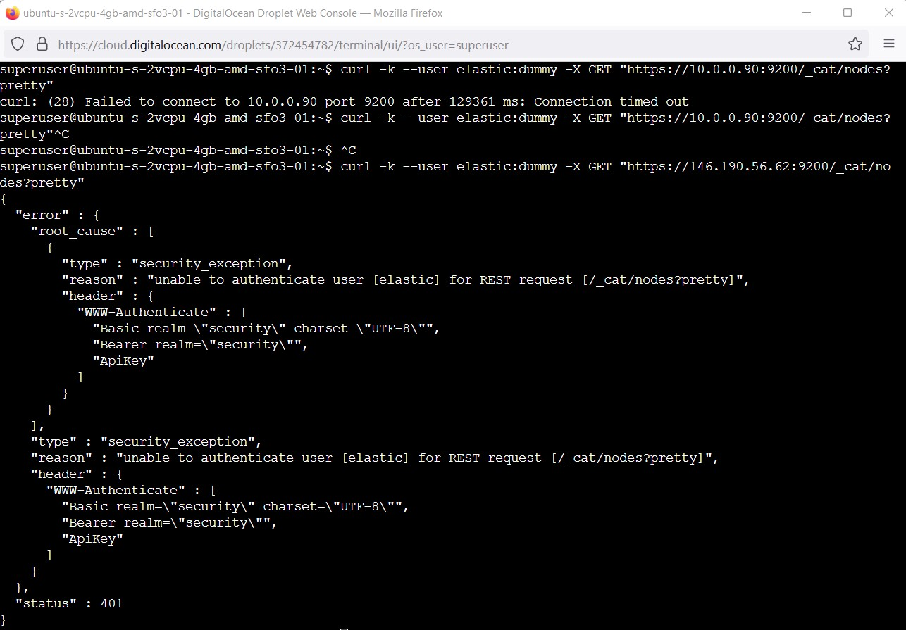

:::{admonition} Lessons Learnt after the 1st attempt
:class: note
1. The default setup of elasticsearch creates self-signing certificates making it difficult to user `curl` to connect.
2. If you attempt to access the database from the command line, it may require addition configurations to your VPS.
:::


#### <u>Attempt 2</u>

I then attempted to set up ElasticSearch as a package within the server itself instead of installing from the archive as per
[this article](https://medium.com/devops-dudes/how-to-deploy-elasticsearch-5b1105e3063a) and
[this article](https://www.digitalocean.com/community/tutorials/how-to-install-and-configure-elasticsearch-on-ubuntu-22-04).

The first error I came across was this one:


I used [this article](https://stackoverflow.com/questions/68992799/warning-apt-key-is-deprecated-manage-keyring-files-in-trusted-gpg-d-instead),
[this article](https://www.elastic.co/guide/en/elasticsearch/reference/current/starting-elasticsearch.html) and
[this article](https://stackoverflow.com/questions/71553340/sudo-apt-get-update-does-not-work-after-trying-to-install-elasticsearch-throug)
to resolve the problem, as shown below:

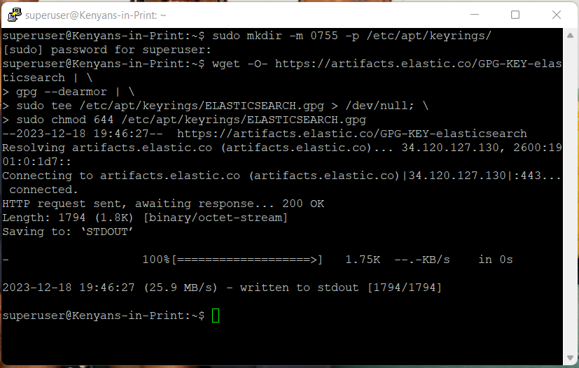


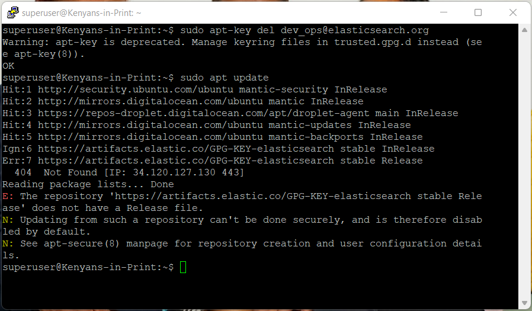

Run once more:
```
sudo nano /etc/apt/sources.list.d/droplet-agent.list
```


The service install for both `elasticsearch` and `kibana` went smoothly from that point as shown below:

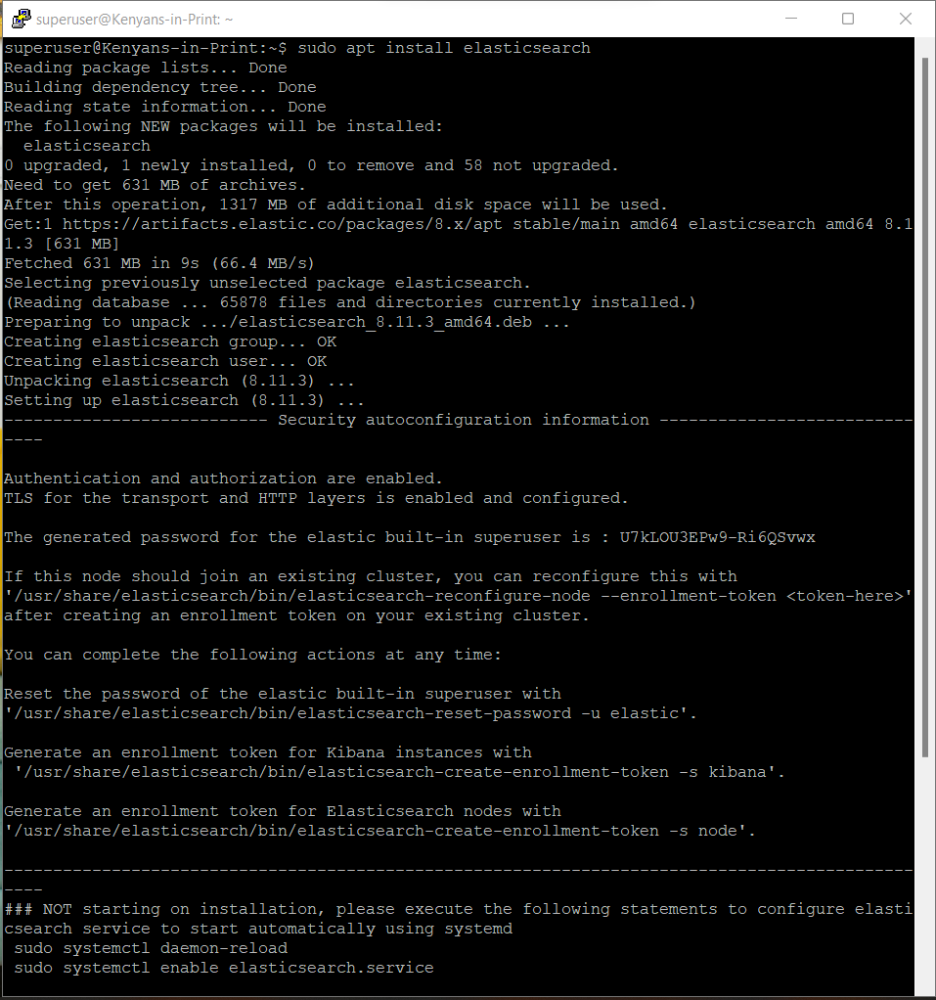


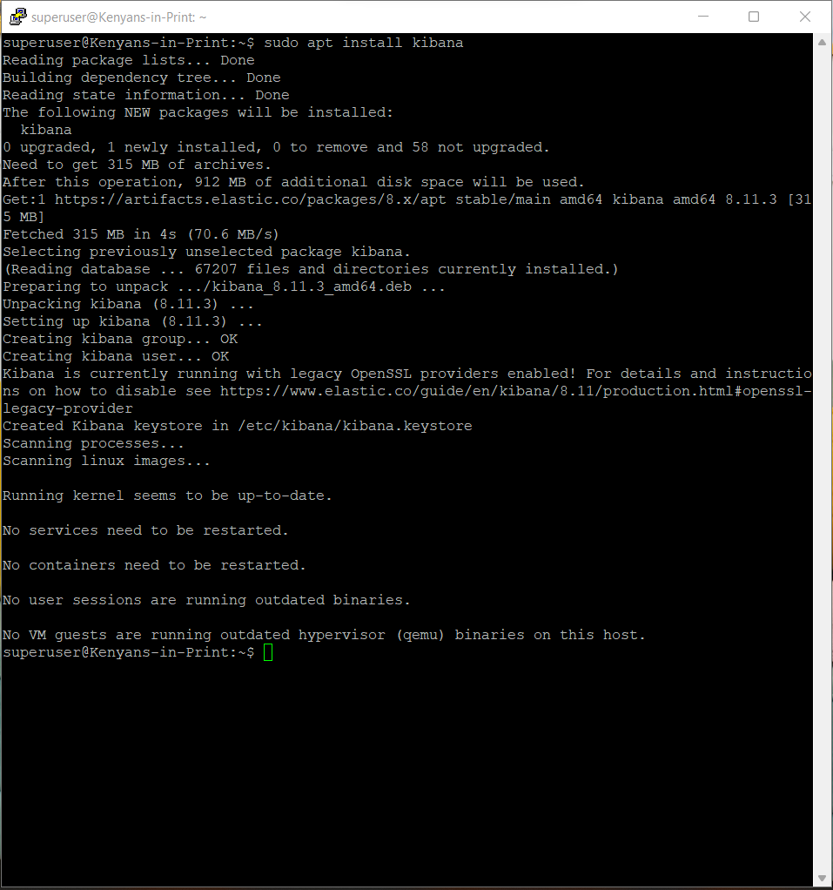


However, I ran into the same problem faced in attempt 1:


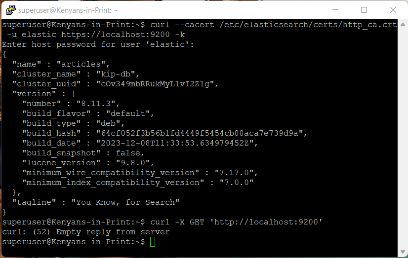

:::{admonition} Lessons Learnt after the 2nd attempt
:class: note
1. Just because Elasticsearch is running in the system does not ensure that you can actually connect to the database. 
:::

Articles that made Attempt 2 change from a failure to a success:

https://www.digitalocean.com/community/tutorials/initial-server-setup-with-ubuntu-22-04

https://www.digitalocean.com/community/tutorials/how-to-install-and-configure-elasticsearch-on-ubuntu-22-04

https://www.elastic.co/guide/en/elasticsearch/reference/current/deb.html

```
curl -fsSL https://artifacts.elastic.co/GPG-KEY-elasticsearch | sudo gpg --dearmor -o /usr/share/keyrings/elastic.gpg
```

What made the above code work is:
* `-fsSL` silences all progress and possible errors (except for a server failure)
* `https://artifacts.elastic.co/GPG-KEY-elasticsearch` is where the Elasticsearch public signing key is located
* `|` means collect of the output from the `curl -fsSL https://artifacts.elastic.co/GPG-KEY-elasticsearch` command and pipe into the `gpg --dearmor -o /usr/share/keyrings/elastic.gpg` command
* `sudo` is the command that allows a user with admin rights act like the `root` user
* `gpg --dearmor` command converts the key into a format that the `apt` package can recognize and use to verify downloaded packages

```
echo "deb [signed-by=/usr/share/keyrings/elastic.gpg] https://artifacts.elastic.co/packages/7.x/apt stable main" | sudo tee -a /etc/apt/sources.list.d/elastic-7.x.list
```

What made the above code work is:
* `echo` displays the output from `"deb [signed-by=/usr/share/keyrings/elastic.gpg] https://artifacts.elastic.co/packages/7.x/apt stable main"` where:
  * The `deb` package is signed by (`signed-by=`) the key readable by `apt` - `/usr/share/keyrings/elastic.gpg`
  * The location of the `deb` package is `https://artifacts.elastic.co/packages/7.x/apt` if downloading the latest version of ElasticSearch 7.x (versions in this series are from 7.0 up to 7.17)
  * The suite of the package being downloaded is a stable release (`stable`) and does not have any dependencies that need to be installed alongside it (`main`) as per [this article](https://askubuntu.com/questions/1032415/what-is-deb-deb-src-stable-xenial-main-in-etc-apt-sources-list#1032736)
* Output from `echo "deb [signed-by=/usr/share/keyrings/elastic.gpg] https://artifacts.elastic.co/packages/7.x/apt stable main"` is a list file (`elastic-7.x.list`) piped to the `sources.list.d` directory where it will be recognized by `apt`
* dd
* dd
* dd


#### <u>Attempt 3</u>

In my final (and successful attempt) I set up ElasticSearch within Docker on the server itself as per
[this article](https://www.digitalocean.com/community/tutorials/how-to-install-and-use-docker-on-ubuntu-22-04),
[this article](https://www.elastic.co/guide/en/elasticsearch/reference/current/docker.html) and
[this article](https://www.coguard.io/post/elasticsearchs-most-common-reason-for-exited-unexpectedly) as shown below:

This will only work if logged in as a user with `sudo` rights.

##### **Step 1: Prep the server to install Docker**


:::{admonition} Step 1 Commands
:class: note
Commands ran were:

1. Update all packages in the server
```
sudo apt update
```

2. Install `apt-transport-https`, `ca-certificates`, `curl` and `software-properties-common` packages, just in case they are not installed.
```
sudo apt install apt-transport-https ca-certificates curl software-properties-common
```

3. Download and save the GPG key for the official Docker repository and have the downloaded repo recognized by APT. 
```
curl -fsSL https://download.docker.com/linux/ubuntu/gpg | sudo gpg --dearmor -o /usr/share/keyrings/docker-archive-keyring.gpg
```
```
echo "deb [arch=$(dpkg --print-architecture) signed-by=/usr/share/keyrings/docker-archive-keyring.gpg] https://download.docker.com/linux/ubuntu $(lsb_release -cs) stable" | sudo tee /etc/apt/sources.list.d/docker.list > /dev/null
```

4. Update the system for the changes to be recognized and ensure that you are downloading from the official Docker website.
```
sudo apt update
```
```
apt-cache policy docker-ce
```
:::

##### **Step 2: Install Docker and set up the user to be recognized by Docker**


:::{admonition} Step 2 Commands
:class: note
Commands ran were:

1. Install Docker.
```
sudo apt install docker-ce
```

2. Check that Docker is running.
```
sudo systemctl status docker
```

3. Avoid typing `sudo` in front of `docker` commands by adding `superuser` to the docker user group. 
```
sudo usermod -aG docker superuser
```
```
su - superuser
```

4. Confirm that `superuser` now belongs to the `docker` group.
```
groups
```
:::


##### **Step 3: Prep system for Elasticsearch and pull the Elasticsearch image from Docker**

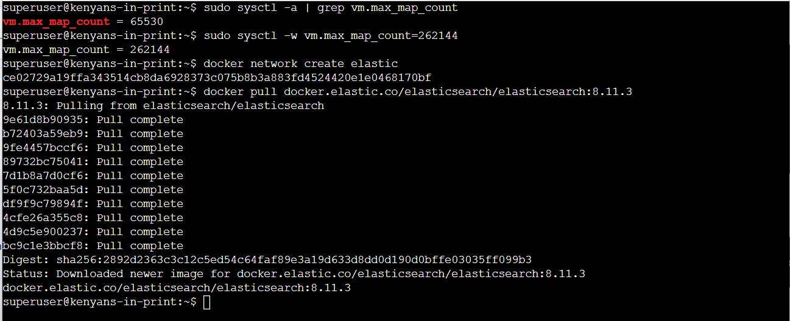

:::{admonition} Step 3 Commands
:class: note
Commands ran were:

1. Determine current maximum RAM memory allocation.
```
sudo sysctl -a | grep vm.max_map_count
```

2. Set the required maximum RAM memory allocation required by ElasticSearch.
```
sudo sysctl -w vm.max_map_count=262144
```

3. Create a new Docker network for ElasticSearch called `elastic`. 
```
docker network create elastic
```

4. Download/Pull from Docker the ElasticSearch image.
```
docker pull docker.elastic.co/elasticsearch/elasticsearch:8.11.3
```
:::

##### **Step 4: Pull the Kibana image from ElasticSearch**


:::{admonition} Step 4 Commands
:class: note
Commands ran were:

1. Download/Pull from Docker the Kibana image.
```
docker pull docker.elastic.co/kibana/kibana:8.11.3
```

**N/B:** *Ensure that the version number of Kibana matches the version number of ElasticSearch.*
:::


##### **Step 5: Configure ElasticSearch for the first time**

In a new terminal, run a new Docker container for ElasticSearch named `kip-db` (or any other name of your choice) that is 1GB in size within the `elastic` network by typing the command below:

```
docker run --name kip-db --net elastic -p 9200:9200 -it -m 1GB docker.elastic.co/elasticsearch/elasticsearch:8.11.3
```

When starting up for the first time, it will output the below:

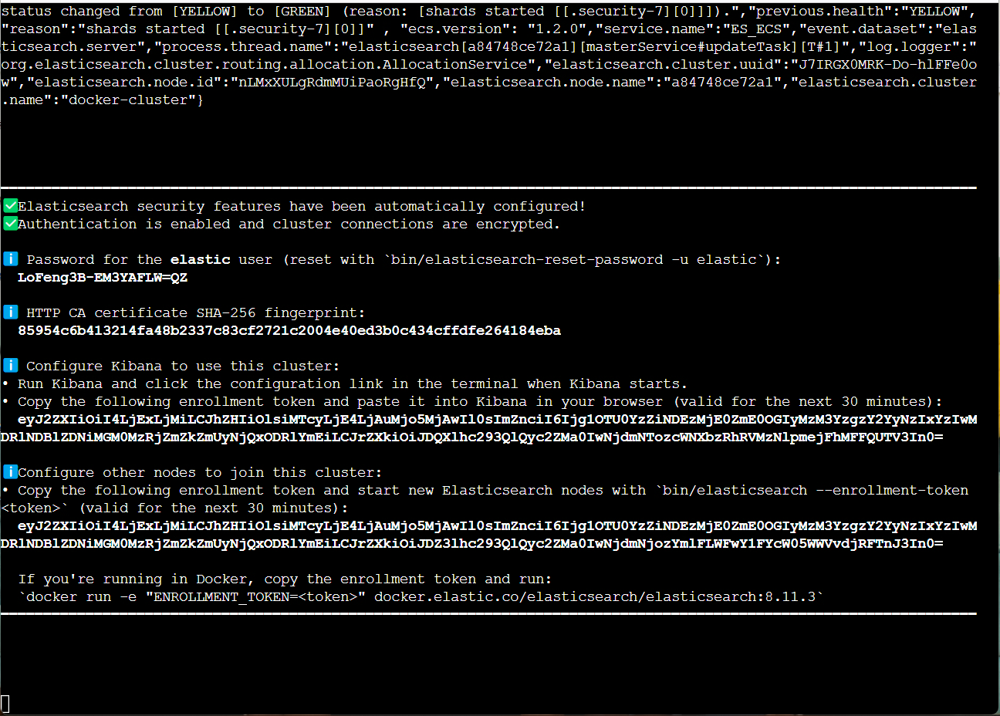

In another new terminal, run a new container for kibana named `kib01` within the `elastic` network by typing the command below:

```
docker run --name kib01 --net elastic -p 5601:5601 docker.elastic.co/kibana/kibana:8.11.3
```

When starting up for the first time, it will output the below:

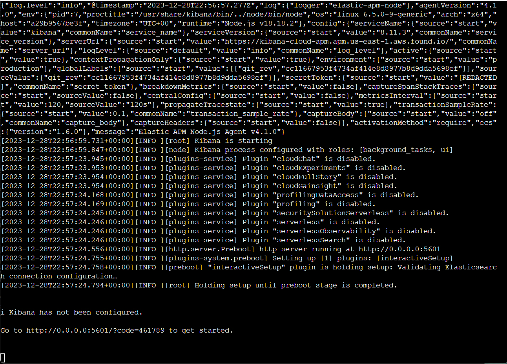

As per the instruction from the terminal running Kibana, I input `http://143.244.182.146:5601/?code=461789` and pasted the enrollment code (copied from the terminal running ElasticSearch) as shown below:


I clicked the `Configure ElasticSearch` button with the following results:


Once configuration was complete, I was able to log in using the username and password as per the instruction from the terminal running ElasticSearch:


Resulting in the following homepage:


And one can add a point of ingestion of data, as shown below:

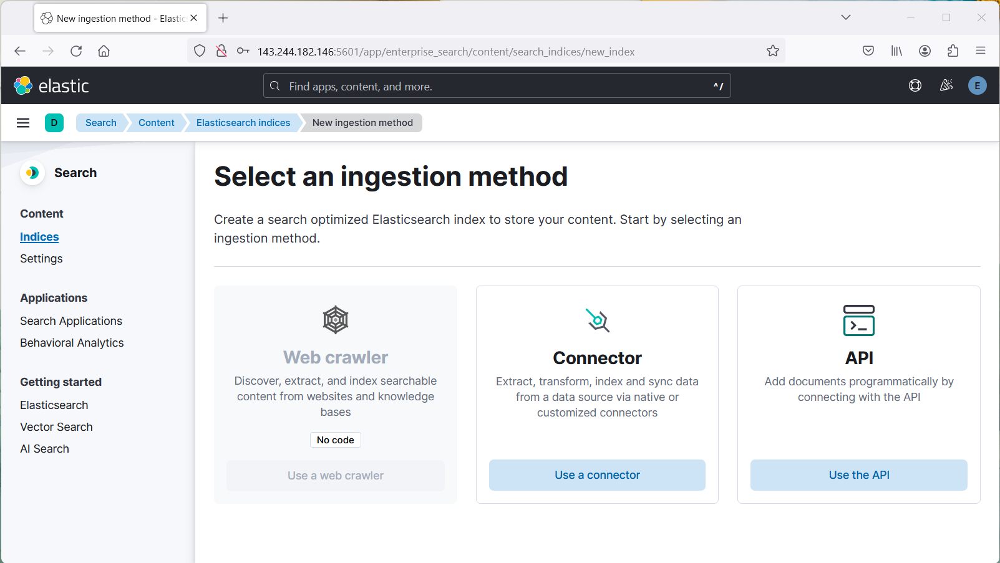

:::{admonition} Step 5 Notes
:class: note
* Once the credentials in each of the terminals are displayed, take note of them. I recommend taking a snip of the 2 terminal outputs.
* The reason you don't run `http://0.0.0.0:5601/?code=461789` or `http://localhost:5601/?code=461789` is because your browser is installed locally and you need to access remote server IP address `143.244.182.146` to access Kibana.<br>Previous attempts to configure the browser on the server and using `curl` did not work, so it's easier to access Kibana from your local device instead of from the server.
* If done with setup and with no other task to complete, you can close ElasticSearch as follows:
  1. Log out of Kibana from the local browser and close the tab
  2. Return to the terminal where Kibana is running and `Ctrl+C` to shut it down, then close the terminal with the `exit` command
  3. Return to the terminal where ElasticSearch is running and `Ctrl+C` to shut it down, then close the terminal with the `exit`
  command entered twice.

:::{admonition} Warning!
:class: warning
Do NOT attempt to copy output from the terminal via `Ctrl+C`! Right-click, then select `Copy` or type manually in a text editor on your local machine to avoid interfering with the background processes.
:::

### Securing *ElasticSearch*

#### Entering an already existing database


```
export ELASTIC_PASSWORD="password"
```

https://www.elastic.co/guide/en/elasticsearch/reference/current/configuring-stack-security.html

https://discuss.elastic.co/t/curl-77-error-setting-certificate-verify-locations/308945

https://geshan.com.np/blog/2023/06/elasticsearch-docker/

https://www.elastic.co/blog/getting-started-with-the-elastic-stack-and-docker-compose
