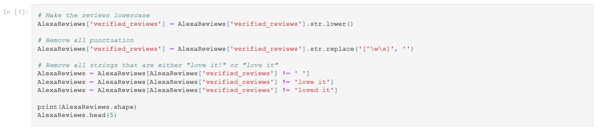
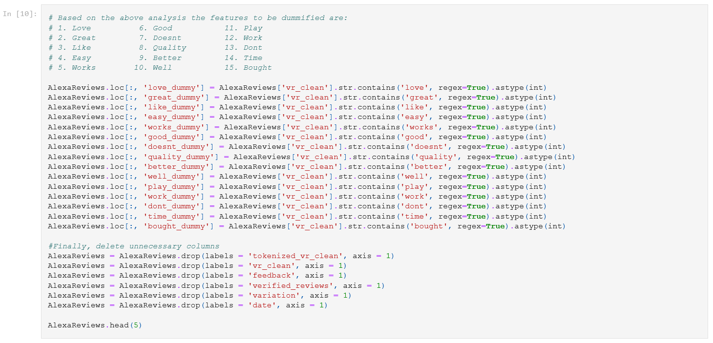
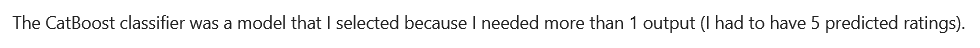
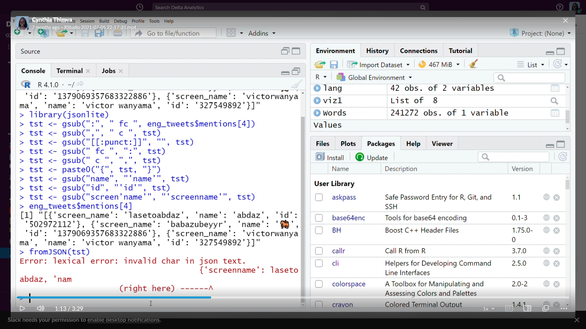
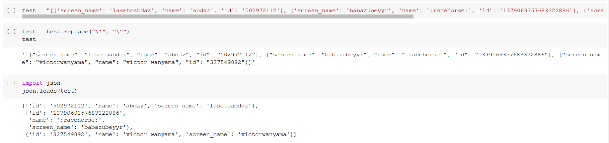
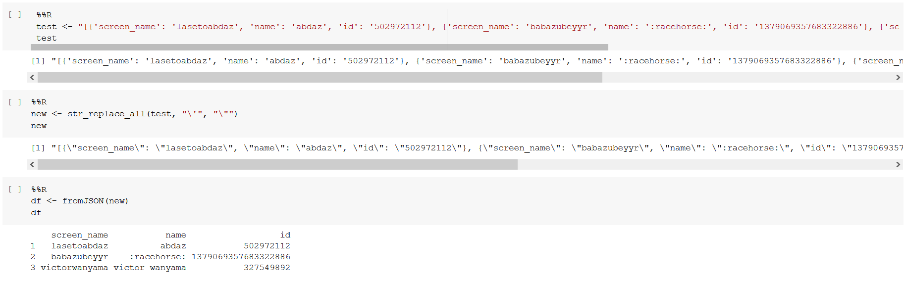

(NLP-experience)=
# My NLP Experiences

The first unstructured data that I ventured to use
for a data science project was text.

## My first experience - handling Amazon Alexa data

Looking for data science work armed with a theoretical foundation
(Microsoft Professional Program in Data Science) and a capstone
project, I was given a challenge based on Amazon Alexa review
data. It was the first time I came across text data. It also did
not help that it had a tight time window - I had to write the
code and markdown for the notebook from scratch, then test and
submit it within 2 hours (he would check the log to confirm).
Needless to say, I did not finish on time - I struggled with it
for a day.

That said, that experience allowed my to get my hands dirty with
text data. In my mind, the use case was obvious in marketing - 
analysing written customer feedback from all communication
channels.

The mistakes that I made at this point include:
1. I repeated myself a lot and did not make use of functions
and list comprehension. An example of such code is below: 
 

 
 
2. While my code did get the job done, it was not reproducible.
I did too many custom tweaks during feature engineering, such
that if I tried using this code on another text dataset, it would
break. This would include use of specific words as filters as
shown below: 
 

 
 
3. I didn't do any model evaluation and interpretation - this
was my version of explaining why I chose a model and a certain
loss function: 
 

### Skills at work

* Data Exploration
* Data Visualization
* Model Training & Evaluation

****

## Working with job ad data

Fast-forward to some months later, I wanted to know what would be
needed to get an applied data science role in marketing. The job
title that I knew at the time was 'Marketing Researcher'.

I decided to mine a job board and restrict results to the USA.
I wondered how to visualise the frequency of words and phrases.
It was at this point that I decided to use *PowerBI* instead of
*Python*'s `matplotlib` - I was more comfortable using the
former.

I also saw that joining words in sequence (way before I had ever
even heard of LSTMs) gave greater context compared to getting
frequency of the word alone. 

To that end, I wrote a function systemizing the same: 
 
 
 
and wrote another function that could generate a mini-report of
the top 5 phrases: 
 

### Skills at work

* Data Mining
* Data Exploration
* Data Visualization

****

## Working with Twitter data in my Delta Analytics fellowship

This period is where I got to really practice and hone skills
in this space, and delve deeper into NLP practices as a whole.

NLP as a field is very wide because it has a variety of data
forms (text, audio and video) and it also has a wide variety of
uses (automation of tasks like translation, data annotation,
transcription, voice synthesis, call analysis, synopsis
generation etc.)

Due to its broad nature, I was forced to create a framework for myself that captured the
overarching concepts in NLP and then solve the problem at hand.
The problem that I aimed to solve in my fellowship was
determining sentiment in multilingual, code-switched
conversations, especially in the Kenyan context. This framework,
the NLP toolbox 🧰, was so useful in helping me structure my
talk in a more scientific way.

The mistakes that I made in this third NLP project were more
meta, less technical in terms of error.
This project helped me learn a lot of things like
1. __Determine if you want to tell a technical or real-world
story.__ 
As I was preparing my graduation lecture, I wanted to show my
process from start to finish - how my conceptual framework/
mental scaffolding worked, and launch into the localised
story and how the framework was applied. 
I found that I needed to choose either the local application
or the framework to present to avoid causing my audience
unnecessary confusion. 
 
2. __Balance simplicity and complexity.__ 
One of the things that made this project gruelling is that I had
to clean data and optimize my model to deliver feasible results
in a short time _AND_ make the content and presenter (me) as
compelling as possible to mixed (technical and non-technical)
audiences while describing the model and interpreting model
findings. 
The fellowship taught a lot of pedagogy that I had to apply
such that
   * technical aspects of the project have to be innovative
   (I combined existing techniques in a new way for local data)
   * key concepts and findings have to be designed into a
   compelling data story and presented in a compelling way
     
3. __The project has to leave the lab and enter production.__
 
This was the first time that I ran R and Python
code in the same notebook, which was great! That said, one of
the challenges of maneuvering a mixed environment in my
notebook is the data had to be downloaded from one environment,
then uploaded into the other environment ready for manipulation.
 
This makes running the project okay in the lab, but it makes the
code very hard to use in production as is. Thankfully, I got to
experience a code lab with *Streamlit* (a Python library
designed to turn a Python script into an app) and join
*Masakhane*, a grassroots movement advancing African
language access in digital spaces. In both spaces, I was
introduced to the concept of a transformer for the first time.
  
4. __Make JSON and other unconventional data formats your
friend.__ 
The Twitter data had a column in JSON, which was a pain to read 
in R:  
  
because it was loaded as a string. After troubleshooting with
my coach, she found
<a href='https://stackoverflow.com/a/42631426'>this solution</a>
and shared how to read JSON in Python: 
   
and R: 
   
5. __Rehearse, rehearse, rehearse.__ 
A common thing that an ad agency will do is to conduct a "*dry run*"
24 hours to a pitch. This is where the presenter presents to the
office as if they were the client. 
This concept applied to teaching or sharing ML/AI concepts
is: do a dry-run as many times as possible
before the main event (maybe 3 times or more). 
Additionally, the presenter, if live-streaming, has to run an
actual live-stream with the team (in my case, my coach Ugaso and
a key facilitator, Melissa). This is incredibly important for
the following reasons:
   * it calms nerves on the actual day
   * it allows the presenter and/or team to spot mistakes in the
   presentation like typos, misaligned content, unclear
   illustrations, slides that are too wordy etc.
   * it allows the team, at the end of the rehearsal, to identify
   mistakes in presentation delivery such as poor flow,
   mispronunciation, lack of eye contact with camera/physical
   audience etc.
   * it allows the team as a whole to master the streaming
   software and preempt possible technical issues e.g. internet
   outage, power outage, poor lighting etc.
   * it trains the presenter to avoid reading the presentation
   slides word for word and instead highlight
   * it ensures that eventually, pedagogy and presenting best
   practice is implemented, such that the presenter can smoothly
   deliver the presentation even with unexpected questions and
   feedback from the audience on the day of the presentation.

### Skills at work

* Data Mining
* Data Exploration
* Data Visualization
* Model Training & Evaluation

